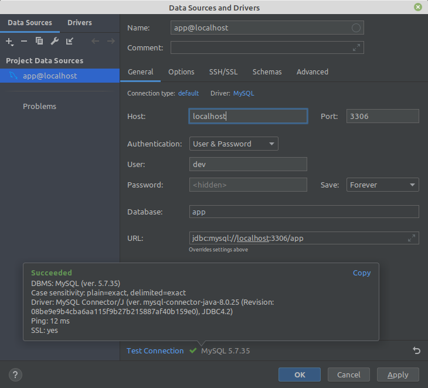

# Skeleton docker php:8.0

Includes: `nginx-proxy`, `php:8.0-cli`, `php:8.0-fpm`, `mysql:5.7`, `adminer` 

> **Note!**
> 
> If you have running local `apache` and `mysql` services, you must stop this services:
> 
> `make stop-local-services`
> 
> To start services again:
> 
> `make start-local-services`

## Init
First run `make init`

If, after init, you see the following message:

> Warning: The lock file is not up to date with the latest changes in composer.json. You may be getting outdated dependencies. It is recommended that you run `composer update` or `composer update <package name>`

you need to run `make composer-update`

## Up
Starts, and attaches to containers for a service `make up`

## Down
Stops and removes containers `make down`

## Other
Other commands see in [Makefile](https://github.com/amberlex78/docker-php/blob/main/Makefile)

## Result

You can see result in browser `http://app.test`

You can see result in console `make php-hello`

---
## What to use in your project?

If your project does not initially have docker, you need copy in your project folder `docker`, and files `docker-compose.yml` and `Makefile`

In the `nginx` image, in the `VIRTUAL_HOST` section, specify the site url.

In the `hosts` file add specify site url
```
127.0.0.1    adminer.test
127.0.0.1    app.test
```
In the `db` image, sets your `MYSQL_DATABASE`, `MYSQL_USER` and `MYSQL_PASSWORD`

The database host will be `db`

### For example Laravel
```
DB_CONNECTION=mysql
DB_HOST=db
DB_PORT=3306
DB_DATABASE=app
DB_USERNAME=dev
DB_PASSWORD=dev
```
### For example Symfony
```
DATABASE_URL=mysql://dev:dev@db:3306/app?serverVersion=5.7
```
### Settings DB for PhpStorm


