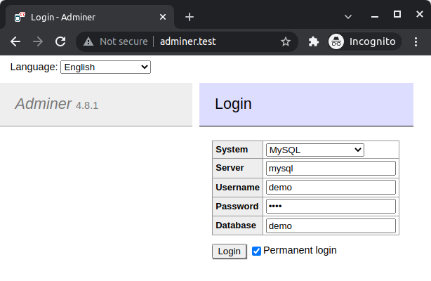
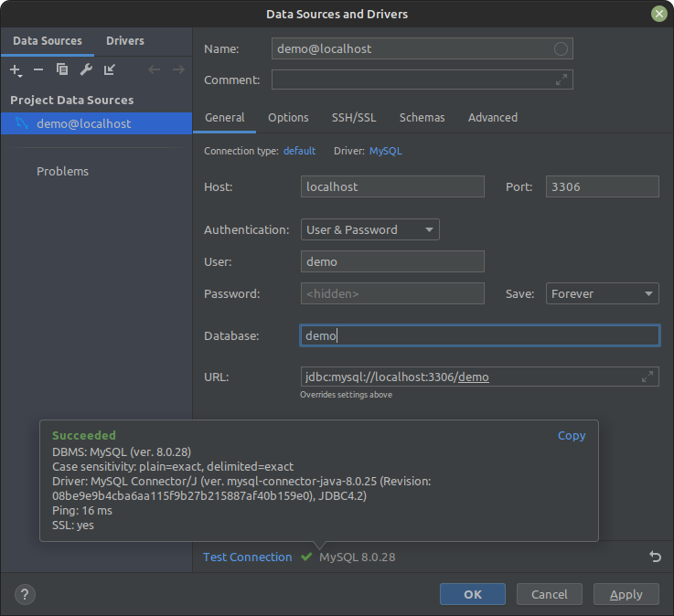

# Docker PHP 8.1, MySQL 8, Nginx for start project

Only for DEV, not for production!

**PHP 8.1 + MySQL 8 + Nginx 1.21.4 + XDebug 3.1.2 + Adminer**

> **Note!**
> 
> If you have running local `apache` and `mysql` services, you must stop this services:
> 
> `make stop-local-services`
> 
> To start services again:
> 
> `make start-local-services`

## Setup
See hostnames in the `.env` file.

Add to `/etc/hosts` file lines:
```
127.0.0.1 docker-php.test
127.0.0.1 adminer.test
```

```
git clone git@github.com:amberlex78/docker-php.git
cd docker-php
make init
```

## Access

You can see result in browser `docker-php.test`

You can see result in console:
```
docker-compose exec php php src/app.php
```

Or log into container:
```
make bash
php src/app.php
```

Result:
```
Hello from: /app/src/app.php
```

## Database

### For Adminer



### For PhpStorm

